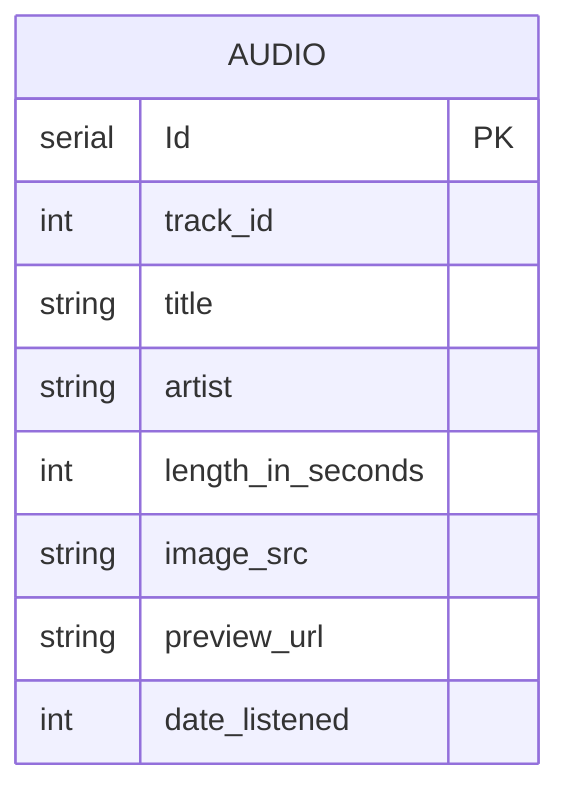

  

<h1 align="center">ambiSound</h1>

By: Steven Liu, Noah Jencz, Samuel Ritchie

## Description
Our application provides users with the ability to listen to ambient noises based on how they are feeling.

## Application Scope
**Purpose**:
- Provide ambient noises fitting mood of users.

**Must-have Features**:
- A prompt for the user to explain how they are feeling.
- Track suggestions using AI and Spotify API.
- History of previously played tracks.
- Audio player functionality.

**Nice-to-have Features**:
- Rewind or skip 5 seonds.
- Adjust play speed.
- Help tooltip.
- Go to previous screen.

**Excluded Features**:
- Playlists.
- Ability to play entirety of soundtracks.
- User Profiles.

## Layout

From left to right
- 🏠 Home Screen
  - Initial screen of the app.
  - Option to enter current feeling in search of new ambient sounds.
  - Option to review previously played ambient sounds.
- 🔍 Search Result Screen
  - Scrollable list of discovered ambient sounds.
  - Each listed ambient sound can be selected (played).
- 🔊 Media Player Screen
  - Information about the selected ambient sound.
  - Manipulation of the media player.
- 📕 History Screen
  - Date annotation.
  - Scrollable list of previously browsed ambient sounds.

## Database Schema

## AI Integration
Our application will make use of Google ML Kit's [Smart Reply Natural Language API](https://developers.google.com/ml-kit/language/smart-reply) in order to take users' input and give them suggestions based on it.
